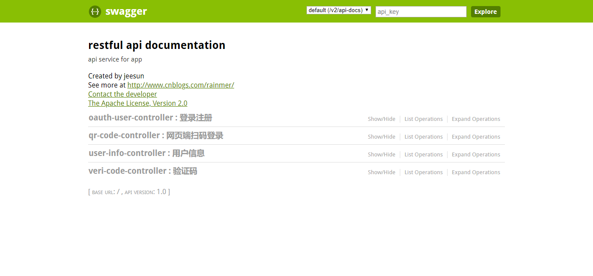

<p align="center">
<a href="http://www.oracle.com/technetwork/java/javase/overview/index.html"></a>
<a href="https://www.jetbrains.com/idea/"></a>
<a href="http://projects.spring.io/spring-boot/"></a>


</p>

# qbankserver

## 简介
qbankserver是一个基于Spring Boot Oauth2的提供用户信息相关接口的服务，该服务依赖于模块[oauthserver](https://github.com/jeesun/oauthserver),无法独立运作。  
qbankserver服务主要提供以下用户信息相关接口：
1. 登录注册
2. 网页端扫码登录（该接口是作为thymelte项目的一部分，详情访问[thymelte](https://github.com/jeesun/thymeltesys)）
3. 用户信息
4. 手机验证码

支持的关系型数据库：
- PostgreSQL
- MySQL

已实现的功能：
1. 集成阿里大于发送手机验证码功能；
2. 集成swagger2，访问[http://localhost:8184/swagger-ui.html](http://localhost:8184/swagger-ui.html)；
3. 封装了[oauthserver](https://github.com/jeesun/oauthserver)模块提供的access_token相关的接口；
4. 日志记录保存到文件，并按日归档；
5. 数据库连接信息加密；
6. 集成Druid数据库连接池。

## 截图


## 使用流程
### 1. 建表
- PostgreSQL
请执行`src/main/resources/schema-pg.sql`，完成数据表的创建和测试数据的导入。
- MySQL
请执行`src/main/resources/schema-mysql.sql`，完成数据表的创建和测试数据的导入。
### 2. 修改数据库连接信息
在application.yml中，配置着数据库的连接信息。其中，配置项username和password是要经过jasypt加密的，不能直接填明文。加密密钥由`jasypt.encryptor.password`配置。你需要使用test目录下的UtilTests工具得到加密字符串。
- PostgreSQL
```
# PostgreSQL连接信息
    driver-class-name: org.postgresql.Driver
    url: jdbc:postgresql://127.0.0.1:5432/thymelte?useUnicode=true&amp;characterEncoding=UTF-8
    username: ENC(hTpbG9fq+7P3SntmXuNtDxbtWDqRuPV+)
    password: ENC(abdq6LyOspryFQHCqzEMTxRozyJVjIA4)
```

- MySQL
```
# MySQL连接信息
    driver-class-name: com.mysql.jdbc.Driver
    url: jdbc:mysql://127.0.0.1:3306/test?useUnicode=true&characterEncoding=utf-8&useSSL=false
    username: ENC(YiYjVwTulDGN//YaB3KbuA==)
    password: ENC(9oaIJkFgGSDFaHH3OXY63RHWQ+amDmiJ)
```
### 3. 导入阿里大于jar
如果你想使用阿里大于验证码功能，首先，你需要把`resources/jars`目录下的`com`文件夹，复制到本地的maven仓库，因为这两个jar是阿里大于依赖的jar。  
然后，你必须配置`application.properties`中`com.alibaba.dayu`开头的配置项。请保证你的支付宝账号有足够余额，用于支付验证码的发送。

### 4. 运行
现在，一切已准备就绪。由于本项目依赖于模块[oauthserver](https://github.com/jeesun/oauthserver)，所以你需要先按照[oauthserver](https://github.com/jeesun/oauthserver)的README.md文档，配置完成`oauthserver`，并启动。然后再运行本项目，当程序成功启动时，即表明你已配置成功。

### 5. 测试
访问[http://localhost:8184/swagger-ui.html](http://localhost:8184/swagger-ui.html)进行相关接口的测试。