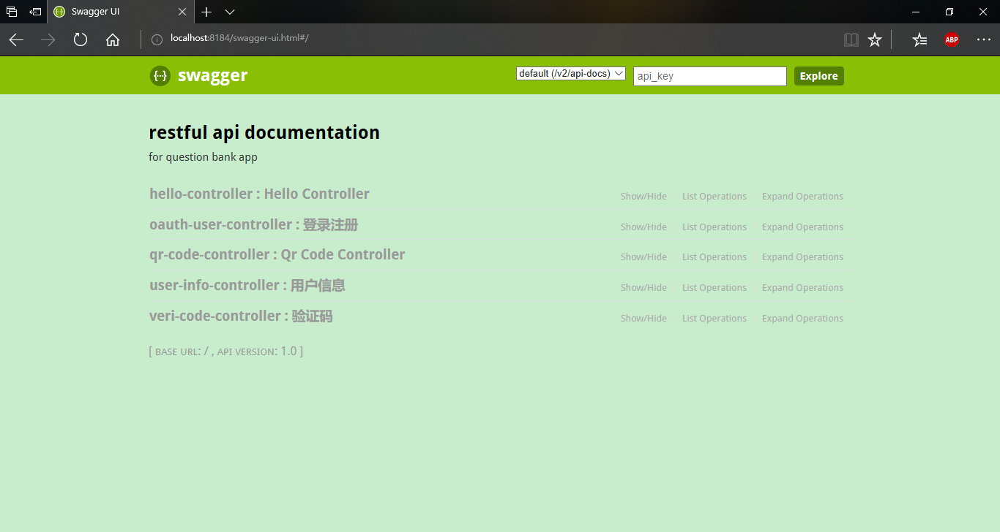

# qbankserver

## 功能列表
- 集成阿里大于发送手机验证码功能；
- 集成swagger2，访问[http://localhost:8184/swagger-ui.html](http://localhost:8184/swagger-ui.html)；
- 封装了`oauthserver`模块提供的access_token相关的接口。

## 截图

## 使用流程
### logback.xml
属性`log.dir`和`log.file.name`，分别配置日志所在目录和日志文件名称。若不修改，则默认的日志保存在项目目录下的logs文件夹内的qbankserver.log文件中。日志已按日归档。
### application.yml
- jasypt.encryptor.password: 用于数据库连接新息的jasypt加密的密码。最好自定义更复杂的密码。
- spring.datasource: 配置数据库连接信息。**注意，此处的用户名和密码信息必须是加密过后的字符串，不能是明文。加密是通过测试类UtilTests的jasyptTest方法进行的。**
### 阿里大于验证码
如果你想使用阿里大于验证码功能，首先，你需要把`resources/jars`目录下的`com`文件夹，复制到本地的maven仓库，因为这两个jar是阿里大于依赖的jar。然后，你必须重新配置`utils/ServerContext.java`中`DAYU`开头的配置项。请保证你的支付宝账号有足够余额，用于支付验证码的发送。`VeriCodeController`包含了获取验证码和验证验证码两个接口。

### git-commit-id-plugin
执行git-commit-id-plugin插件

在target/classes目录下，生成了一个git.properties配置信息，这个文件就是当前项目的git信息。然后你可以访问[http://localhost:8184/info](http://localhost:8184/info)访问项目信息。